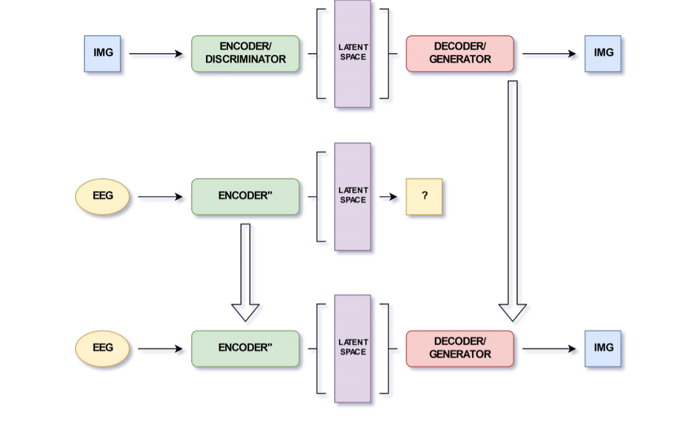

## Visual Reconstruction of Image from SpokenWord using EEG
[Datasets](https://github.com/Aryan05/EEG-Datasets)
[Link to my Abstract Research Paper](https://drive.google.com/file/d/16cq5Ty7G8bhE7XBZeqt2OUUrW80ZaxHN/view?usp=sharing)

### ABSTRACT
In this project, the main motivation was to construct images from person’s spoken words . We have designed and trained a deep
neural network to perform this task using a large data set of people
brain EEG signal. Thus, have collected a EEG dataset consisting of
2000 audio and visualisation events which can be used to analyse
temporal visual and auditory responses to spoken word stimuli.And
finally everything was implemented on MNIST data set. 

    

## Steps

    

## Loss Graph

### Results
We test our model both qualitatively and quantitatively on the
MNIST dataset . Our goal is to gain insights and to quantify how
closely oure model predicts.

    

